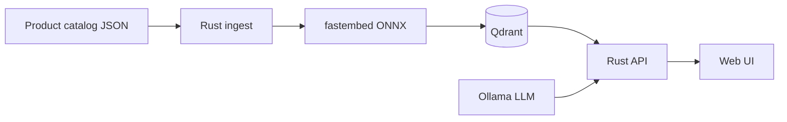
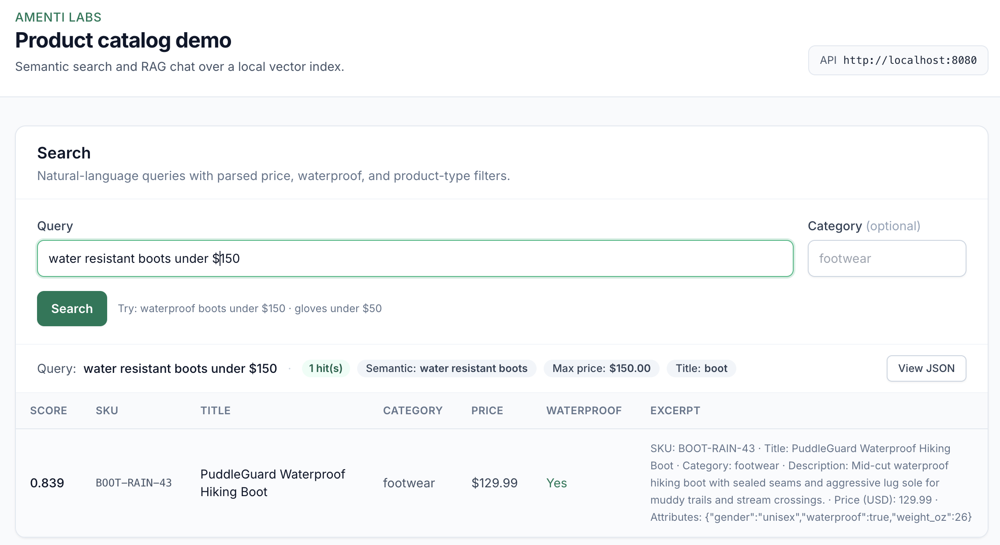
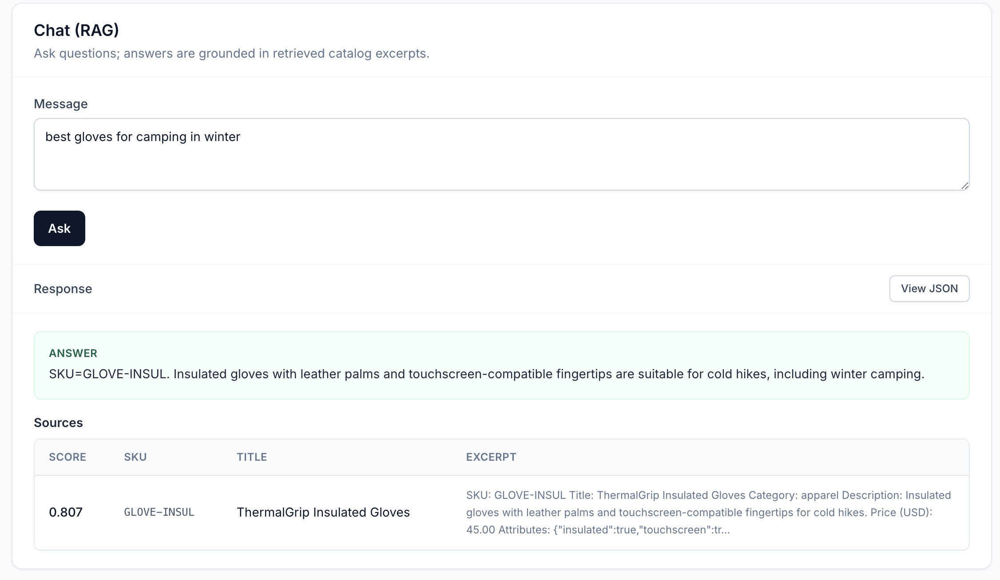

# product-rag

A reference implementation for **semantic product search** and **RAG-powered catalog chat** over your own product data—running locally with Docker, without tying you to a specific cloud vendor or spending on tokens.

## Why this matters

Retail and B2B teams store rich product data in PIMs, ERPs, and feeds, but discovery still depends on exact SKUs, filters, and keyword search. Customers and internal users ask questions in plain language—“waterproof boots under $150,” “lightest two-person tent,” “gloves that work with touchscreens”—and expect direct answers.

This project shows how to close that gap with a practical pattern:

- **Semantic search** — find products by meaning, not just token overlap, with optional structured constraints (price ceiling, attributes like waterproof, product type).
- **Grounded answers** — a language model answers *only* from retrieved catalog excerpts, so responses stay tied to your inventory instead of general web knowledge.

The stack is small, auditable, and suitable for a proof of concept on a laptop or a single server before you scale to production embeddings, hosted vector DBs, or your existing commerce APIs.

## What is RAG?

**RAG** (Retrieval-Augmented Generation) combines two steps:

1. **Retrieval** — turn the user’s question into a vector, search a product index (here: Qdrant), and pull the most relevant catalog chunks.
2. **Generation** — send those chunks to an LLM with strict instructions to answer from that context only.

Search alone returns ranked products; RAG adds a natural-language explanation, comparisons, and follow-up-friendly answers—while still grounding every claim in retrieved SKUs and descriptions. When nothing in the catalog fits, the system can say so instead of inventing products.

## Architecture



#### Semantic Search



```json
{
  "query": "water resistant boots under $150",
  "filters_applied": {
    "semantic_query": "water resistant boots",
    "max_price_usd": 150,
    "title_contains": [
      "boot"
    ]
  },
  "hits": [
    {
      "score": 0.8392868,
      "product_id": "prod-021",
      "sku": "BOOT-RAIN-43",
      "title": "PuddleGuard Waterproof Hiking Boot",
      "category": "footwear",
      "chunk_index": 0,
      "text": "SKU: BOOT-RAIN-43\nTitle: PuddleGuard Waterproof Hiking Boot\nCategory: footwear\nDescription: Mid-cut waterproof hiking boot with sealed seams and aggressive lug sole for muddy trails and stream crossings.\nPrice (USD): 129.99\nAttributes: {\"gender\":\"unisex\",\"waterproof\":true,\"weight_oz\":26}",
      "price_usd": 129.99,
      "waterproof": true
    }
  ]
}
```

#### RAG Chat



```json
{
  "answer": "SKU=GLOVE-INSUL. Insulated gloves with leather palms and touchscreen-compatible fingertips are suitable for cold hikes, including winter camping.",
  "session_id": null,
  "sources": [
    {
      "sku": "GLOVE-INSUL",
      "title": "ThermalGrip Insulated Gloves",
      "score": 0.80734134,
      "excerpt": "SKU: GLOVE-INSUL\nTitle: ThermalGrip Insulated Gloves\nCategory: apparel\nDescription: Insulated gloves with leather palms and touchscreen-compatible fingertips for cold hikes.\nPrice (USD): 45.00\nAttributes: {\"insulated\":true,\"touchscreen\":tr…"
    }
  ]
}
```

## Tech stack

| Layer | Tool |
|-------|------|
| Embeddings | [fastembed-rs](https://github.com/Anush008/fastembed-rs) (`bge-small-en-v1.5`) |
| Vector DB | [Qdrant](https://qdrant.tech/) |
| Chat / agent | [Ollama](https://ollama.com) + [Rig](https://rig.rs/) |
| API | Rust, [axum](https://github.com/tokio-rs/axum) |
| Runtime | Docker Compose |

Tuned for **Intel Mac, CPU-only** (no GPU): default chat model `llama3.2:3b`, embedding model `BAAI/bge-small-en-v1.5` (384-dim).

## Prerequisites

- Docker Desktop (Intel Mac is supported; containers run **Linux amd64**)
- **16 GB RAM** recommended (8 GB minimum if only `llama3.2:3b`)
- ~2 GB disk for Ollama model + ONNX embedding weights (first run)

**Note:** Native `cargo build` on **x86_64 macOS** is not supported (ONNX Runtime has no prebuilt for that target). Build and run through Docker.

## Quick start

```bash
cp .env.example .env
docker compose up -d qdrant ollama
# wait until qdrant is healthy, then run one-shot ingest detached
docker compose --profile ingest up --build -d ingest
docker compose logs -f ingest   # wait for "ingest complete"
docker compose up -d --build api web
```

Pull the chat model (once):

```bash
docker compose exec ollama ollama pull llama3.2:3b
```

Check health:

```bash
curl -s http://localhost:8080/health | jq
```

Semantic search:

```bash
curl -s http://localhost:8080/v1/search \
  -H 'Content-Type: application/json' \
  -d '{"query":"waterproof hiking boots under 200","limit":5}' | jq
```

RAG chat (may take 10–30s on CPU):

```bash
curl -s http://localhost:8080/v1/chat \
  -H 'Content-Type: application/json' \
  -d '{"message":"Which two-person tent is under 3.5 pounds?"}' | jq
```

Web UI: [http://localhost:3000](http://localhost:3000)

## Faster local iteration

The stack uses:

- Multi-target Docker builds (`dev` and `release`)
- `cargo-chef` dependency-layer caching
- BuildKit cache mounts for cargo registry/git/target
- Optional ingest profile to avoid one-shot rebuilds during API-only edits

### Recommended command wrappers

```bash
make up-core        # start qdrant + ollama only
make ingest         # run one-shot ingest (builds ingest image)
make api            # build/start api + web UI
make full           # full stack with ingest profile
make build-release  # release images for api + ingest
```

### Equivalent Docker commands

```bash
docker compose up -d qdrant ollama
docker compose --profile ingest up --build ingest
docker compose up -d --build api web
```

### Warm vs cold build behavior

- **Cold build:** still expensive (compiles Rust + ONNX/tooling deps).
- **Warm build (code-only changes):** much faster; cached dependency layers are reused.
- **Cache invalidators:** changes to `Cargo.toml`, `Cargo.lock`, crate dependency graph, or Dockerfile build stages.

## Optional prebuilt mode

If you publish app images (GHCR or similar), skip local compilation:

```bash
docker compose -f docker-compose.yml -f docker-compose.prebuilt.yml --profile prebuilt up -d
```

Env vars for prebuilt tags:

- `API_PREBUILT_IMAGE` (default `ghcr.io/amenti-labs-ai/product-rag-api:latest`)
- `INGEST_PREBUILT_IMAGE` (default `ghcr.io/amenti-labs-ai/product-rag-ingest:latest`)

## Intel Mac tuning

| Setting | Default | Purpose |
|---------|---------|---------|
| `OLLAMA_MODEL` | `llama3.2:3b` | Small model for CPU chat |
| `OLLAMA_NUM_THREADS` | `4` | Leave cores for Qdrant/API |
| `RAG_TOP_K` | `3` | Smaller prompts |
| `INGEST_BATCH_SIZE` | `32` | Embedding batch size |

Avoid 7B+ models on this profile.

## API

| Method | Path | Description |
|--------|------|-------------|
| GET | `/health` | Qdrant + Ollama status |
| POST | `/v1/search` | Semantic search with parsed constraints (`under $50`, `waterproof`, product type in title). Response includes `filters_applied` and structured hit fields (`price_usd`, `waterproof`). Optional `filter.category`. |
| POST | `/v1/chat` | `{ "message", "session_id?", "filter?" }` |

## Roadmap

- Migrate to GPU for faster inference and improved scalability, especially for larger models and production workloads. Evaluate GPU options (local, cloud, Colab, AWS/GCP/Azure) and modify Docker/Ollama/Qdrant configurations to enable GPU acceleration.

## License

MIT
